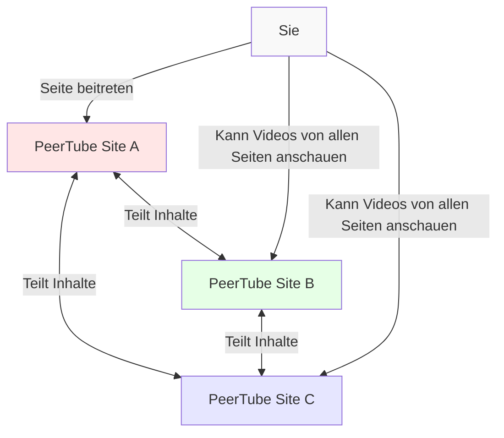
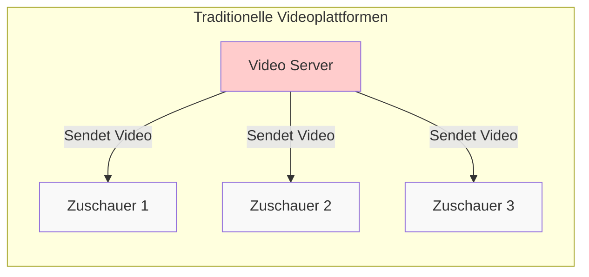
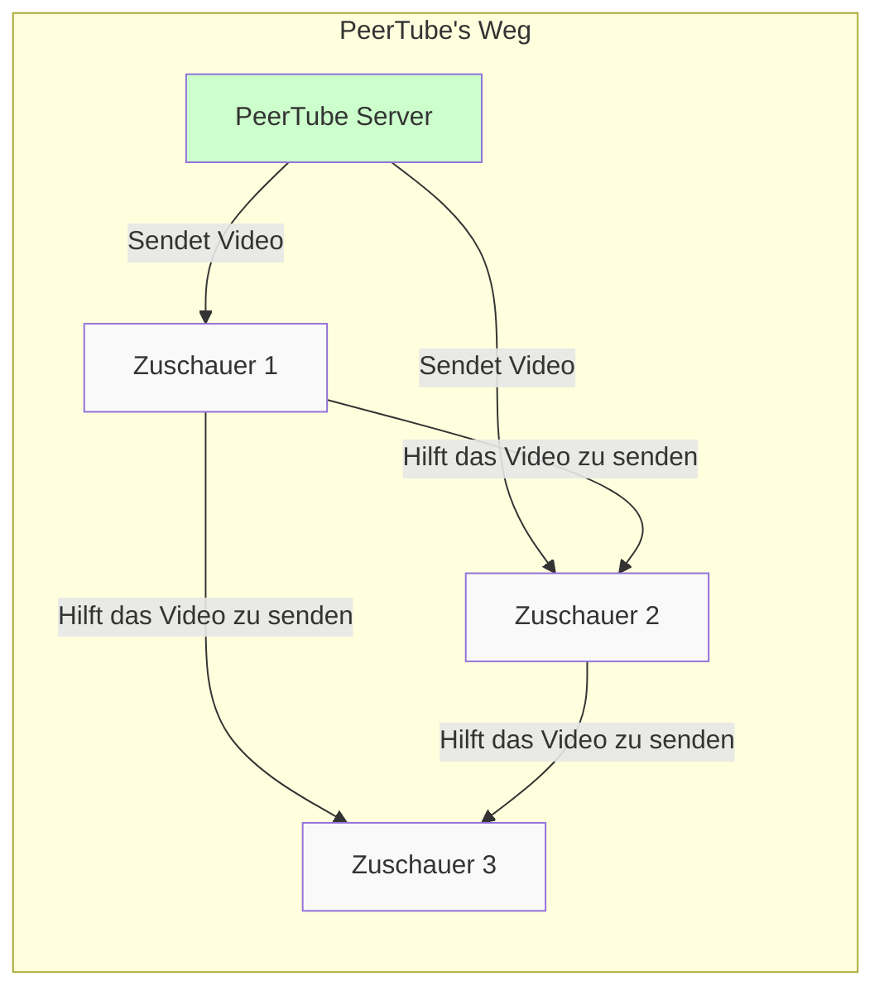

# Peertube
## Eine Alternative zu den Videoplattformen der Tech-Riesen

---
transition: slide-left
zoom: 1.5
layout: default-4
---
# Was ist Peertube?
- Open Source Videoplattform
- Activitypub-Föderation aka *Fediverse*
- P2P-Übertragungen via WebRTC
<QualleMitVideo class="absolute right-5% bottom-5%" width="20%" />

<!-- 
P2P = Peer-to-Peer
Activitypub = Protokol mit dem z.Bsp. Mastodon und Pixelfed miteinander reden
-->
---
transition: slide-left
zoom: 1.5
layout: default-2
---
# Warum sollte ich Peertube benutzen?
- Datenschutz
- Fediverse
- Freie Software unterstützen
<Qualle class="pt-20 absolute right-5% bottom-5%"/>

<!--
Datenschutz: Youtube und Co. benutzen Tracking und Algorithmen für Vorschläge
-->
---
zoom: 0.9
layout: default-3
---
# Wie Funktioniert Peertube denn?

---
layout: right
---
# Wie spart Peertube Bandbreite und verhindert Überlastung?

---
layout: section
transition: slide-up
---
# Hilfreiches Tool: Instanzübergreifende Suche
[Suche: https://joinpeertube.org/browse-content](https://joinpeertube.org/browse-content)
<QualleSearch class="absolute right-5% top-5%" width="20%" />
---
layout: iframe
url: https://joinpeertube.org/browse-content
---
---
transition: slide-left
layout: section-3
---
# Wie benutze ich Peertube denn?
<QualleFrage class="absolute right-5% top-5%"/>
<!-- Live-Demo -->
---
transition: slide-up
layout: default-5
---
# Klingt cool, wo kann ich starten?
- Videos benötigen viel Speicherplatz, deshalb schwer Instanz zu finden die Registrierung zulässt.
- Die geschlossene Registrierung schützt die Platformbetreiber
- Zum Anschauen von Videos benötigt man kein Konto
<QualleFrage class="absolute right-5% bottom-5%"/>

## Instanzen mit offener Registrierung
- [Peertube Instanz-Liste unter https://joinpeertube.org/instances](https://joinpeertube.org/instances)
- [Adminforge: clip.place](https://clip.place/)
- [edutainment content: tilvids.com](https://tilvids.com/)
- [Musik: v.basspistol.org](https://v.basspistol.org)
<!-- 
Auf der Digitalcourage-Instanz ist die Registrierung auch nicht offen und wir werden sie auch zum aktuellen Zeitpunkt nicht öffnen
-->
---
transition: slide-left
layout: iframe
url: https://joinpeertube.org/instances
---
---
transition: slide-up
layout: section
---
# Kann ich vielleicht meine 
# eigene Instanz installieren?

---
transition: slide-up
layout: iframe
url: https://docs.joinpeertube.org/install/any-os
---
---
layout: iframe
url: https://docs.joinpeertube.org/install/docker
---
---
layout: quote
---

# Danke für
 
 

# eure Aufmerksamkeit
---
layout: section-2
---
# Habt ihr
# noch Fragen?
<QualleFrage class="absolute right-5% bottom-5%"/>
---
layout: default-6
---
# Quellen
- https://joinpeertube.org/
- https://www.davidrevoy.com/data/images/blog/2023/2023_peertube-generator.jpg
